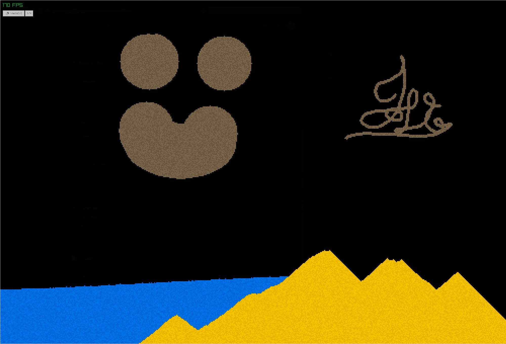

# Falling Sand Simulator

A C++ particle simulation game (Falling Sand) using [Raylib](https://www.raylib.com/) for rendering and [Raygui](https://github.com/raysan5/raygui) for the UI.



## 📋 Features
- Particle physics simulation (sand, water, stone, etc.).
- User Interface for element selection.
- High-performance rendering with Raylib.

## ⚙️ Project Structure
```text
├── include/      # Header files (.h) and raygui library
├── src/          # Source code (.cpp)
├── obj/          # Compiled object files (auto-generated)
├── Makefile      # Build system
└── README.md     # Documentation
```

### 🚀 Requirements
**Linux**

You need `g++`, make, and the raylib development library installed.

(Debian)
``` bash
sudo apt update
sudo apt install build-essential libraylib-dev
```
(Arch btw)
``` bash
sudo pacman -S base-devel raylib
```

### 🛠️ Build & Run
The project includes an optimized **Makefile**. Simply run:

1. **Compile**:
``` bash
make
```

2. **Run**:
``` bash
./arena
```

3. **Clean up (optional)**:
``` bash
    make fclean
```

### 🎮 Controls
- **Left Click**: Draw particles / Interact with UI.

- **X**: Terminate program

- **V**: Select void (erase)

- **A**: Select sand (arena)

- **W**: Select water

- **F**: Select wood

- **MouseWheel**: Change brush size


### Developed by pepedregosa0.

### Credits
    Libraries: Raylib & Raygui.
